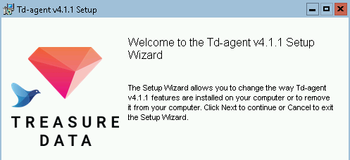
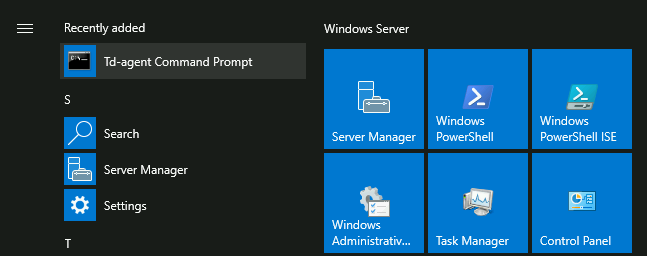
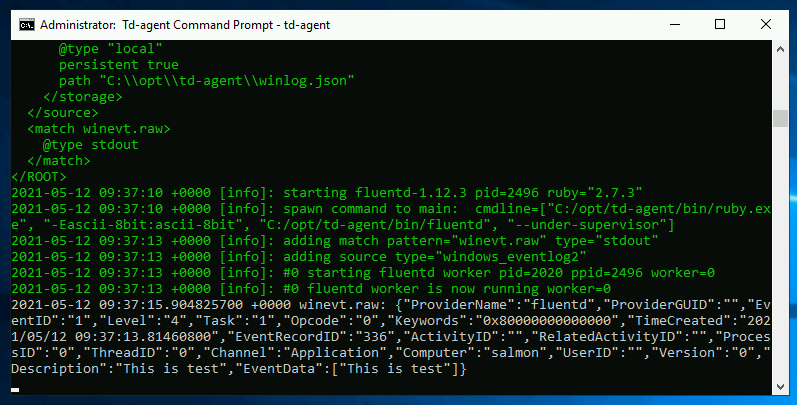
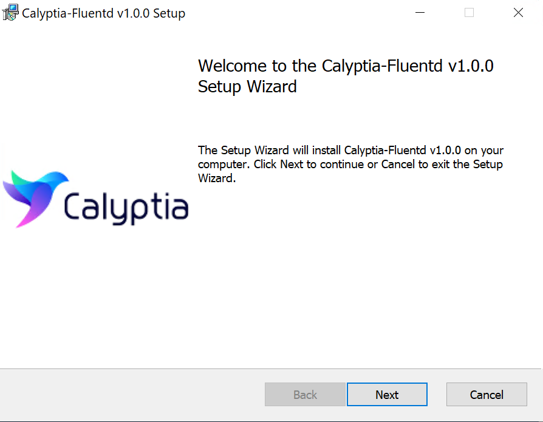

# Install by .msi Installer \(Windows\)

The recommended way to install Fluentd on Windows is to use MSI installers of `td-agent`.

## What is `td-agent`?

`td-agent` is a packaged distribution of Fluentd.

* Includes Ruby and other library dependencies \(since most Windows machines don't have them installed\).
* Includes a set of commonly-used 3rd-party plugins such as `out_es`.
* Originally developed by [Treasure Data, Inc](http://www.treasuredata.com/) \(hence the name\).

Currently two versions of `td-agent` are available.

* `td-agent` v4 packages Fluentd 1.11.x \(or later\). This version is recommended.
* `td-agent` v3 packages Fluentd 1.10.x \(or below\).

## What is `calyptia-fluentd`?

`calyptia-fluentd` is the alternative distribution of Fluentd.

* Includes Ruby and other library dependencies \(since most Windows box are not installed\).
* Includes a set of frequently-used 3rd party plugins such as `out_elasticsearch` and `in_windows_eventlog2`.
* This alternative agent is developed by [Calyptia, Inc.](https://www.calyptia.com/).

Currently, calyptia-fluentd is on v1 only.

* `calyptia-fluentd` v1 packages Fluentd 1.12.x \(or later\).

## `td-agent` v4

### Step 1: Install `td-agent`

Download the latest MSI installer from [the download page](https://td-agent-package-browser.herokuapp.com/4/windows). Run the installer and follow the wizard.



Alternatively `td-agent` can be installed with [winget](https://www.microsoft.com/en-us/p/app-installer/9nblggh4nns1):

```text
> winget install td-agent
```

### Step 2: Set up `td-agent.conf`

Open `C:/opt/td-agent/etc/td-agent/td-agent.conf` with a text editor. Replace the configuration with the following content:

```text
<source>
  @type windows_eventlog2
  @id windows_eventlog2
  channels application
  read_existing_events false
  tag winevt.raw
  rate_limit 200
  <storage>
    @type local
    persistent true
    path C:\opt\td-agent\winlog.json
  </storage>
</source>

<match winevt.raw>
  @type stdout
</match>
```

### Step 3: Launch Td-agent Command Prompt

Open Windows Start menu, and search `Td-agent Command Prompt`. In most environments, the program will be found right under the "Recently Added" section.



`Td-agent Command Prompt` is basically `cmd.exe`, with a few PATH tweaks for `td-agent` programs. Use this program whenever you need to interact with `td-agent`.

### Step 4: Run `td-agent`

Type the following command into `Td-agent Command Prompt`:

```text
C:\opt\td-agent> td-agent
```

Now `td-agent` starts listening to Windows Eventlog, and will print records to stdout as they occur.



### Step 5: Run `td-agent` as Windows service

Since version 4.0.0, `td-agent` is registered as a Windows service permanently by the msi installer. You can start `td-agent` service manually.

#### Using GUI

Please guide yourself to `Control Panel -> System and Security -> Administrative Tools -> Services`, and you'll see `Fluentd Windows Service` is listed.

Please double click `Fluentd Window Service`, and click `Start` button. Then the process will be executed as Windows Service.

#### Using `net.exe`

```text
> net start fluentdwinsvc
The Fluentd Windows Service service is starting..
The Fluentd Windows Service service was started successfully.
```

#### Using Powershell Cmdlet

```text
PS> Start-Service fluentdwinsvc
```

Note that using `fluentdwinsvc` is needed to start Fluentd service from the command-line. `fluentdwinsvc` is the service name and it should be passed to `net.exe` or `Start-Service` Cmdlet.

The log file will be located at `C:/opt/td-agent/td-agent.log` as we specified in Step 3.

### Step 6: Install Plugins

Open `Td-agent Command Prompt` and use `fluent-gem` command:

```text
C:\opt\td-agent> td-agent-gem install fluent-plugin-xyz --version=1.2.3
```

## `td-agent` v3

### Step 1: Install `td-agent`

Please download and install the `.msi` file from here:

* [Download](https://td-agent-package-browser.herokuapp.com/3/windows)

### Step 2: Run `td-agent` from Command Prompt

First, please prepare your config file located at `C:/opt/td-agent/etc/td-agent/td-agent.conf`. The config below is the simplest example to output any incoming records to `td-agent`'s log file:

```text
<source>
  @type forward
</source>
<match test.**>
  @type stdout
</match>
```

After you have installed the .msi package, you will see the program called `Td-agent Command Prompt` installed. Please double click this icon in the Windows menu \(below is how it looks like on Windows Server 2012\).


In the prompt, please execute the command below to launch `td-agent` process:

```text
> fluentd -c etc\td-agent\td-agent.conf
```

Then, please launch another `Td-agent Command Prompt` and type the command below to send a record to `td-agent` process:

```text
> echo {"message":"hello"} | fluent-cat test.event
```

It's working properly if td-agent process outputs:

```text
test.event: {"k", "v"}
```

[](https://github.com/fluent/fluentd-docs-gitbook/tree/da81ba70252eaa863cc28fc888584c59d6fc14d3/images/td-agent-windows-prompt.png)

### Step 3: Register `td-agent` to Windows Service

Next, register `td-agent` as a Windows Service to permanently run as a server process. Open `Td-agent Command Prompt` with administrative privileges, and type these commands:

```text
> fluentd --reg-winsvc i
> fluentd --reg-winsvc-fluentdopt '-c C:/opt/td-agent/etc/td-agent/td-agent.conf -o C:/opt/td-agent/td-agent.log'
```

**NOTE**: Making `td-agent` service start automatically requires additional command-line parameters:

```text
> fluentd --reg-winsvc i --reg-winsvc-auto-start --reg-winsvc-delay-start
> fluentd --reg-winsvc-fluentdopt '-c C:/opt/td-agent/etc/td-agent/td-agent.conf -o C:/opt/td-agent/td-agent.log'
```

### Step 4: Run `td-agent` as a Windows Service

#### Using GUI

Go to `Control Panel > System and Security > Administrative Tools > Services`, and you should see `Fluentd Windows Service` listed there.

Double click on `Fluentd Window Service` and click `Start` to execute it as a Windows Service.

#### Using `net.exe`

```text
> net start fluentdwinsvc
The Fluentd Windows Service service is starting..
The Fluentd Windows Service service was started successfully.
```

#### Using Powershell Cmdlet

```text
PS> Start-Service fluentdwinsvc
```

Note that `fluentdwinsvc` is the Fluentd service name and it should be passed to `net.exe` or `Start-Service` Cmdlet to start.

The log file will be located at `C:/opt/td-agent/td-agent.log` as specified in Step 3 earlier.

### Step 4: Install Plugins

Open `Td-agent Command Prompt` and use `fluent-gem` command:

```text
> fluent-gem install fluent-plugin-xyz --version=1.2.3
```

## Tips

### Manage privileges in td-agent 3.8.1 or later/td-agent 4.1.0 or later

You need admin privilege to execute `td-agent-gem` command. For upgrade users since 3.8.0 or earlier/td-agent 4.0.1 or earlier, explicitly remove privileges for `NT AUTHORITY\Authenticated Users` from `c:\opt\td-agent`.

This change is for fixing [CVE-2020-28169](https://cve.mitre.org/cgi-bin/cvename.cgi?name=CVE-2020-28169).

## `calyptia-fluentd` v1

### Step 1: Install `calyptia-fluentd`

Download the latest MSI installer from [the download page](https://calyptia-fluentd.s3.us-east-2.amazonaws.com/index.html?prefix=1/windows/). Run the installer and follow the wizard.



**Note:** Calyptia-Fluentd is a drop-in-replacement agent of other Fluentd stable distribution. Currently, we use the same Windows Service name which is `fluentdwinsvc`. This is because when you already installed other agent which register Windows Service as `fluentdwinsvc`, you must uninstall already installed Windows Service which uses `fluentdwinsvc` as service name.

### Step 2: Set up `calyptia-fluentd.conf`

Open `C:/opt/calyptia-fluentd/etc/calyptia-fluentd/calyptia-fluentd.conf` with a text editor. Replace the configuration with the following content:

```text
<source>
  @type windows_eventlog2
  @id windows_eventlog2
  channels application
  read_existing_events false
  tag winevt.raw
  rate_limit 200
  <storage>
    @type local
    persistent true
    path C:\opt\td-agent\winlog.json
  </storage>
</source>

<match winevt.raw>
  @type stdout
</match>
```

### Step 3: Launch Calyptia-Fluentd Command Prompt

Open Windows Start menu, and search `Calyptia-fluentd Command Prompt`. In most environments, the program will be found right under the "Recently Added" section.

`Calyptia-fluentd Command Prompt` is basically `cmd.exe`, with a few PATH tweaks for `calyptia-fluentd` programs. Use this program whenever you need to interact with `calyptia-fluentd`.

### Step 4: Run `calyptia-fluentd`

Type the following command into `Calyptia-fluentd Command Prompt`:

```text
C:\opt\calyptia-fluentd> calyptia-fluentd
```

Now `calyptia-fluentd` starts listening to Windows Eventlog, and will print records to stdout after consuming Windows EventLog Events on Application channel.

### Step 5: Run `calyptia-fluentd` as Windows service

As of first released version, `calyptia-fluentd` will register as a Windows service as `fluentdwinsvc` by the msi installer. Also, You can manage `calyptia-fluentd` service manually.

#### Using GUI

Please guide yourself to `Control Panel -> System and Security -> Administrative Tools -> Services`, and you'll see `Fluentd Windows Service` is listed.

Please double click `Fluentd Window Service`, and click `Start` button. Then the process will be executed as Windows Service.

#### Using `net.exe`

```text
> net start fluentdwinsvc
The Fluentd Windows Service service is starting..
The Fluentd Windows Service service was started successfully.
```

#### Using Powershell Cmdlet

```text
PS> Start-Service fluentdwinsvc
```

Note that using `fluentdwinsvc` is needed to start Fluentd service from the command-line. `fluentdwinsvc` is the service name and it should be passed to `net.exe` or `Start-Service` Cmdlet.

The log file will be located at `C:/opt/calyptia-fluentd/calyptia-fleuntd.log` as we specified in Step 3.

### Step 6: Install Plugins

Open `Calyptia-fluentd Command Prompt` and use `calyptia-fluentd-gem` command as Administrator:

```text
C:\opt\calyptia-fluentd> calyptia-fluentd-gem install fluent-plugin-xyz --version=1.2.3
```

## Next Steps

You are now ready to collect real logs with Fluentd. Refer to the following tutorials on how to collect data from various sources:

* Basic Configuration
  * [Config File](../configuration/config-file.md)
* Application Logs
  * [Ruby](../language-bindings/ruby.md)
  * [Java](../language-bindings/java.md)
  * [Python](../language-bindings/python.md)
  * [PHP](../language-bindings/php.md)
  * [Perl](../language-bindings/perl.md)
  * [Node.js](../language-bindings/nodejs.md)
  * [Scala](../language-bindings/scala.md)
* Examples
  * [Store Apache Log into Amazon S3](../how-to-guides/apache-to-s3.md)
  * [Store Apache Log into MongoDB](../how-to-guides/apache-to-mongodb.md)
  * [Data Collection into HDFS](../how-to-guides/http-to-hdfs.md)

For further steps, follow these:

* [ChangeLog of td-agent](https://docs.treasuredata.com/display/public/PD/The+td-agent+Change+Log)
* [Chef Cookbook](https://github.com/treasure-data/chef-td-agent/)

If this article is incorrect or outdated, or omits critical information, please [let us know](https://github.com/fluent/fluentd-docs-gitbook/issues?state=open). [Fluentd](http://www.fluentd.org/) is an open-source project under [Cloud Native Computing Foundation \(CNCF\)](https://cncf.io/). All components are available under the Apache 2 License.

